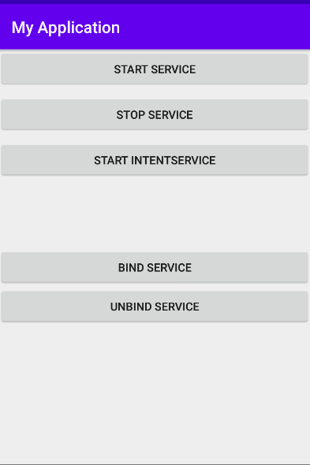

## 服务

### 启动和停止服务

启动服务：

在设置中可以找到

点击停止服务：

### 服务代码运行在显示子线程

点击start intentservice

可以看到，MyIntentService和MainActivity所在的线程id不一样。

### 子服务的绑定，子服务代码运行在异步任务

绑定服务

点击bind service

可以看到，首先是MyService的onCreate()方法得到了执行，然后startDownload()和getProgress()方法都得到了执行。

点击unbind service:

服务被取消绑定